# [BDK] RPG ASSISTANT - BOT DE AUXILIO RPG

Seja bem-vindo ao manual do [BDK] RPG ASSISTANT.

> ## Adicione o bot ao seu servidor clicando [aqui](http://bit.ly/3uTC70q).

> ## Entre no nosso servidor no [Discord](https://discord.gg/XuNnEwYbx4).

> ## Siga nosso [Instagram](https://www.instagram.com/bdk_rpg/).

Este bot tem o intuito de deixar a jogatina a distância um pouco mais simples, no momento conta com apenas essas funções mas olha só, um spoiler, enquanto você lê isso outras funções estão sendo desenvolvidas, acompanhe nosso [Instagram](https://www.instagram.com/bdk_rpg/) para não perder nenhuma novidade.

Qualquer duvida, sugestão, reporte de bugs ou qualquer outro assunto não exite em entrar em contato em um dos canais mencionados acima.

## Menu Rápido

  - [Rolagem de dados(Opcional)](#rolagem-de-dados)
  - [Iniciativa](#iniciativa)
    - [Começando](#inicio-de-uma-disputa)
    - [Jogadores](#jogadores-entrando)
    - [Npcs](#npcs)
    - [Modificadores](#modificadores)
      - [Positivo](#modificador-positivo)
      - [Negativo](#modificador-negativo)
      - [Valor pré-definido](#valor-pré-definido)
    - [Hordas](#hordas)
    - [Batalha](#hora-da-briga)
  - [Controle de dano](#controle-de-dano)
    - [Causando dano](#causando-dano)
    - [Recebendo cura](#recebendo-cura)
    - [Desmaio/Morte](#o-participante-caiu)
    - [Retornando a luta](#voltando-a-luta)
    - [Comandos em massa](#danocura-em-massa)

---

## Rolagem de dados
[Topo](#bdk-rpg-assistant---bot-de-auxilio-rpg)

> **IMPORTANTE:** Agora por padrão as rolagens de DADOS (EX: 1d20) estão desativadas devido vários usuários preferirem usar rolagens de bots já existentes.
> 
> Caso queira usar a rolagem do nosso bot basta enviar no canal em que deseja usa-lo o comando **.rolagem**
> 
> Para desativar as rolagens em um canal basta enviar **.desativa-rolagem**
>
>  Para consultar o status atual dessa opção envie **.status-rolagem**

* Rolagem normal -> 1d20
* Rolagem com modificadores -> 1d20+5
* Rolagem com vantagem(Adicionar * no final) -> 1d20+5*
* Rolagem com desvantagem(Adicionar / no final) -> 1d20+5/
* Rolagem múltipla, basta adicionar a quantidade de vezes seguida de # -> 2#d20+5

>**IMPORTANTE: O número máximo de dados e faces permitidas é 100, acima disso o Bot ira considerar como 1.**

## Iniciativa
[Topo](#bdk-rpg-assistant---bot-de-auxilio-rpg)

### Inicio de uma disputa

O mestre deve enviar **iniciativa** e aparecerá a seguinte resposta:

### Jogadores entrando

Em seguida os jogadores enviam **ini** seguido do seu bônus e receberá o valor da sua iniciativa para aquela batalha

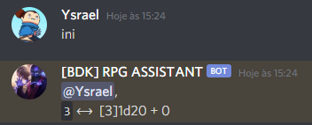

### NPCS

Para adcionar um npc na batalha, basta inserir o nome dele após o 'ini'. Exemplo: **ini monstro**

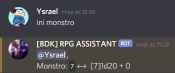

### Modificadores

Os detalhes a seguir se aplicam a jogadores e npcs.

#### Modificador positivo

Se meu personagem possui +5 de bônus de iniciativa por exemplo, use **ini +5**.

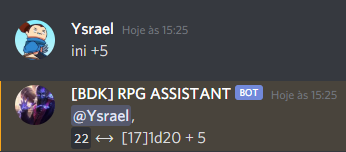

#### Modificador negativo

Caso seja negativo adicionar o sinal - por exemplo, use **ini -5**

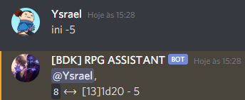

#### Valor pré-definido

Para usar um valor pré-definido de iniciativa ao invés de uma rolagem, baste inserir o valor entre (), exemplo: **ini (15)**

.png)

> Todos os casos acima são validos para NPCS, apenas use um '.' para separar, exemplo: **ini monstro.+3** ou **ini monstro.(10)**

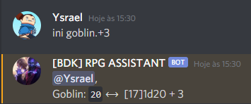

.png)

#### Hordas

Para adicionar mais de um npc simultâneo use a quantidade seguida de um # e nome do monstro, exemplo: **ini 3#orc.+2**

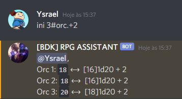

### Hora da Briga

Depois de todos participantes rolarem suas iniciativas basta enviar 'batalha' para ver a ordem de combate e o dano sofrido de cada participante

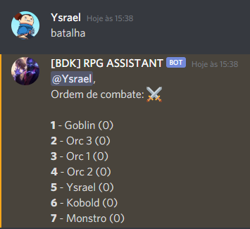

> Extra: Para ver o valor de Iniciativa dos participantes envie **batalha.i**
>
> 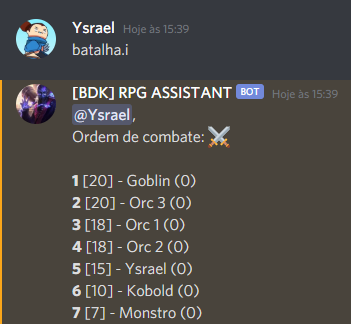

## Controle de dano
[Topo](#bdk-rpg-assistant---bot-de-auxilio-rpg)

Para controle de dano é usado o simbolo $ em conjunto com as informações da ordem de combate.

### Vida máxima dos jogadores

Para facilitar ainda mais o controle do Hp dos jogadores para o mestre, basta pedir que cada um dos seus jogadores envie apenas uma vez o comando **.vida** seguido do valor máximo de vida deles.

A partir do envio deste comando **TODAS** as batalhas que este jogador participar neste canal será exibida a sua vida máxima e sua vida atual.

### Causando dano

Para causar dano a um participante da batalha deve inserir a posição dele que é a primeira coluna do exemplo:

Para causar 5 de dano ao Goblin, basta enviar no chat **1$5**.

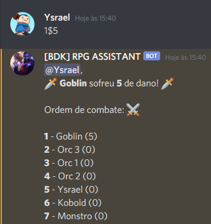

### Recebendo cura

De forma semelhante para cura, devendo apenas adicionar o valor negativo (1$-2).

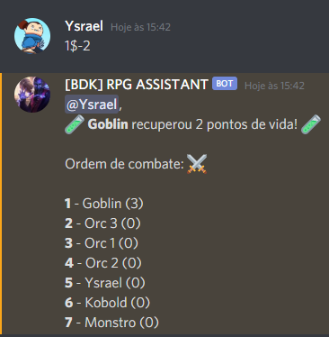

### O participante caiu

Para declarar um participante como incapacitado na batalha basta enviar o mesmo comando de dano apenas substituindo o dano por 'ko' (4$ko).

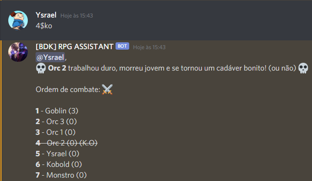

>Bônus: Quando um participante é incapacitado, uma frase ou brincadeira é enviada enfatizando o ocorrido.

### Voltando a luta

Mas a morte nem sempre é o fim, você sempre pode contar com aquele clérigo gente boa que vai te prestar socorro e em casos mais extremos, trazer você de volta a vida. Nessa ocasião basta substituir o dano/cura por 'revive' (4$revive).

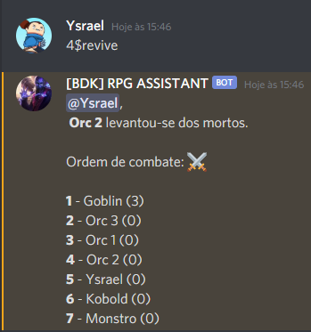

>Bônus: Quando um participante é revivido, uma frase ou brincadeira é enviada enfatizando o ocorrido.

### Dano/Cura em massa

Os comando citados acima podem ser usados em mais de um participante por vez. Basta utilizar uma virgula para separar suas colocações.

Exemplo: O goblin e o kobold acabaram de receber uma bola de fogo na cabeça e foram conhecer seus respectivos criadores, envie **1,6$ko**.

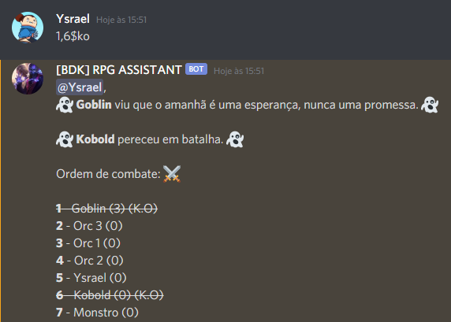

Da mesma forma os outros comandos:

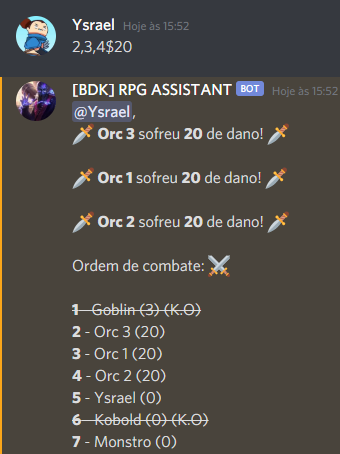

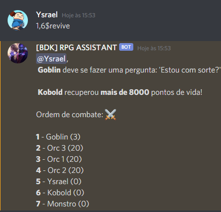

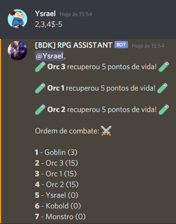

[Topo](#bdk-rpg-assistant---bot-de-auxilio-rpg)
